# JOHNNY OWAYED
## SENIOR iOS & FLUTTER DEVELOPER

+961 71 213 231 | johnny.owayed@gmail.com | [LinkedIn](https://www.linkedin.com/in/johnnyowayed/)

---

## Featured Projects

<h3> Simly - iOS App</h3>

<table width="100%">
<tr>
<td>

#### Overview
Developed and maintained an iOS app with over 1M+ users, ensuring high performance and scalability.

#### Technical Highlights
- Introduced SwiftUI screens to enhance UI consistency and performance
- Utilized Combine for reactive programming and improved data flow management
- Achieved 99.99% crash-free sessions, providing stable and reliable user experience
- Enhanced user engagement through advanced UI/UX designs and animations
- Ensured app scalability to handle a growing user base of over 1 million users

</td>
</tr>
<tr>
<td>

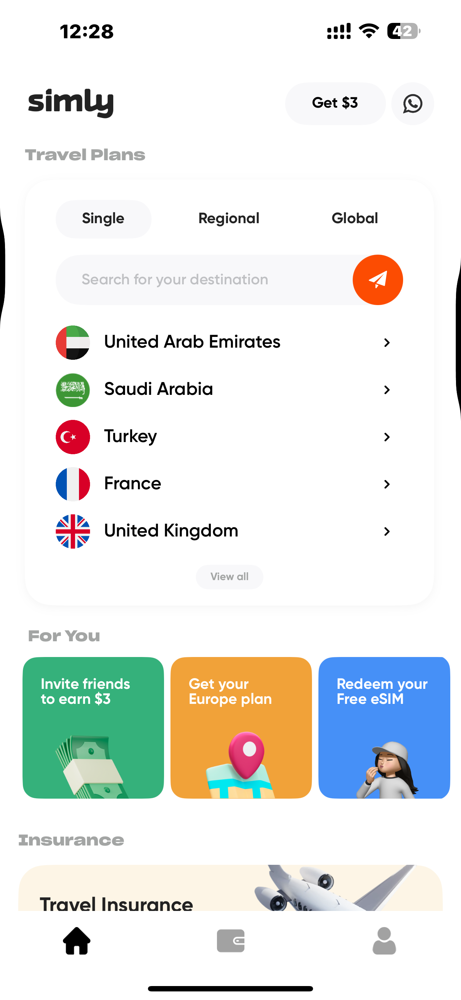
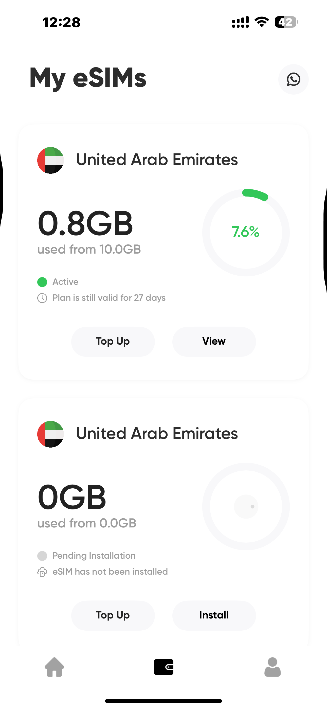
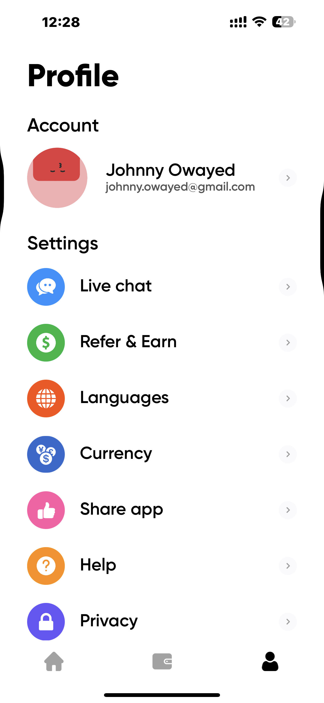

</td>
</tr>
</table>

---

<h3> AI Video Generator - Serda</h3>

<table width="100%">
<tr>
<td>

#### Overview
Led the development of an AI-powered video generation application using Flutter, delivering a seamless cross-platform experience.

#### Technical Highlights
- Implemented complex AI integration for automated video creation from text prompts
- Built responsive UI with Flutter and Bloc state management
- Integrated with cloud services for media processing and storage
- Developed custom video rendering and editing capabilities
- Created intuitive user experience for AI-assisted content creation

</td>
</tr>
<tr>
<td>

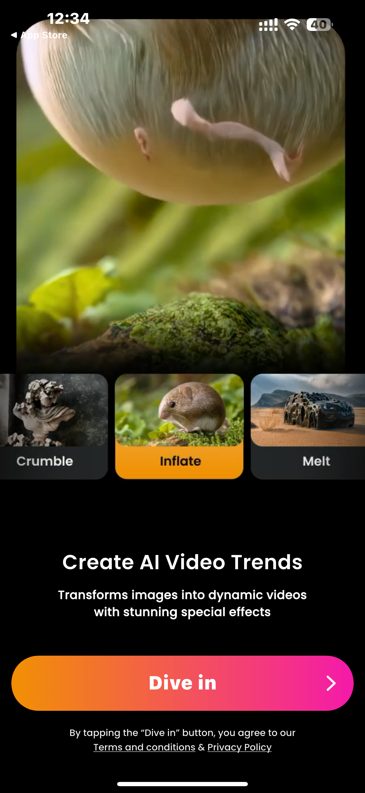
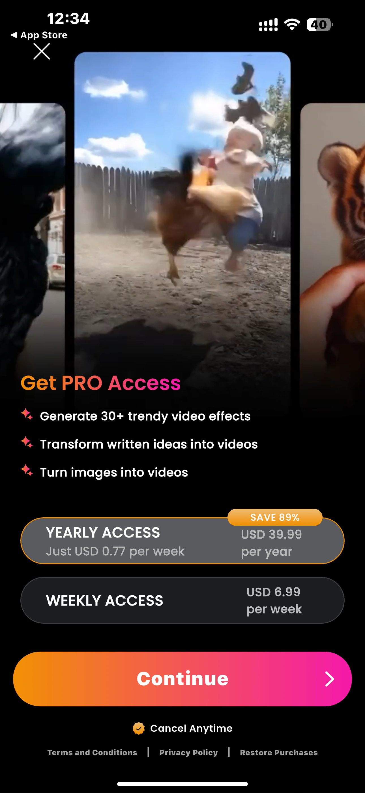
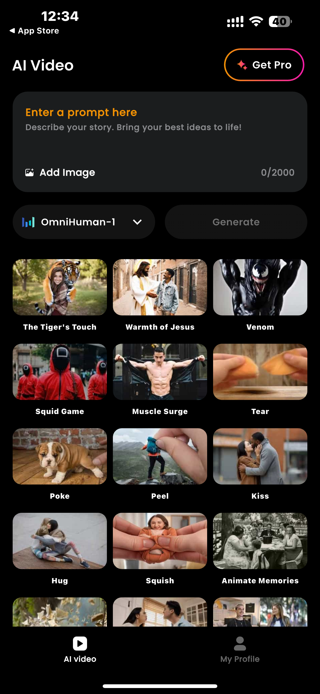

</td>
</tr>
</table>

---

<h3> Yara - Dubai Real Estate</h3>

<table width="100%">
<tr>
<td>

#### Overview
Developed a specialized real estate application focused on luxury apartment sales in Dubai, offering seamless property browsing and purchasing experience.

#### Technical Highlights
- Built with Flutter for consistent experience across iOS and Android platforms
- Implemented interactive property maps and 3D apartment visualization
- Integrated secure payment gateway for property reservations and deposits
- Created personalized user accounts with favorite properties and viewing history
- Developed advanced search filters and recommendation algorithms based on user preferences

</td>
</tr>
<tr>
<td>

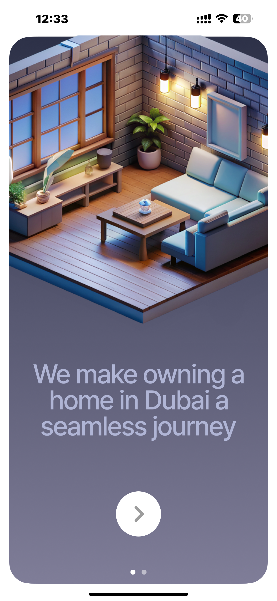
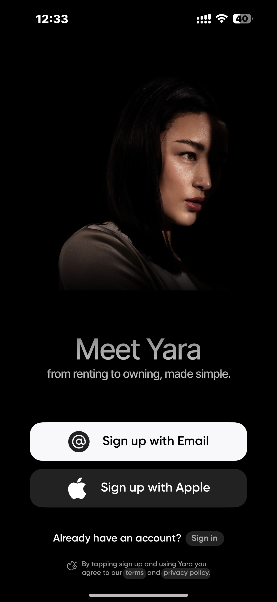
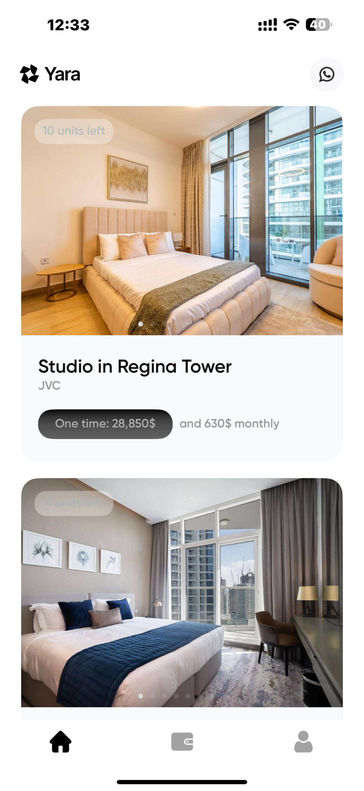

</td>
</tr>
</table>

---

<h3>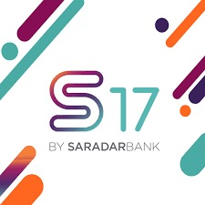 Banking App - Saradar Bank</h3>

<table width="100%">
<tr>
<td>

#### Overview
Improved banking app functionality by developing features within an Agile team of 5 members.

#### Technical Highlights
- Improved app performance, reducing load times by 25%
- Increased application reliability through performance optimization and unit tests
- Advanced app development by adopting modern architectures like MVVM and RxSwift
- Collaborated effectively within an Agile environment
- Designed and implemented robust financial features for secure banking operations

</td>
</tr>
<tr>
<td>

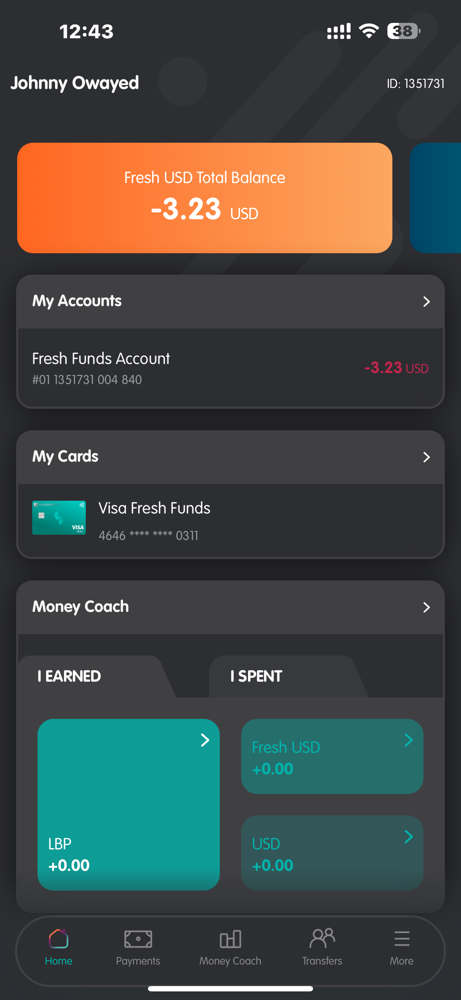
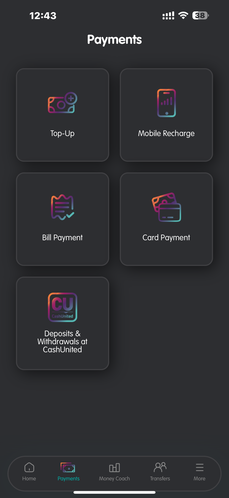
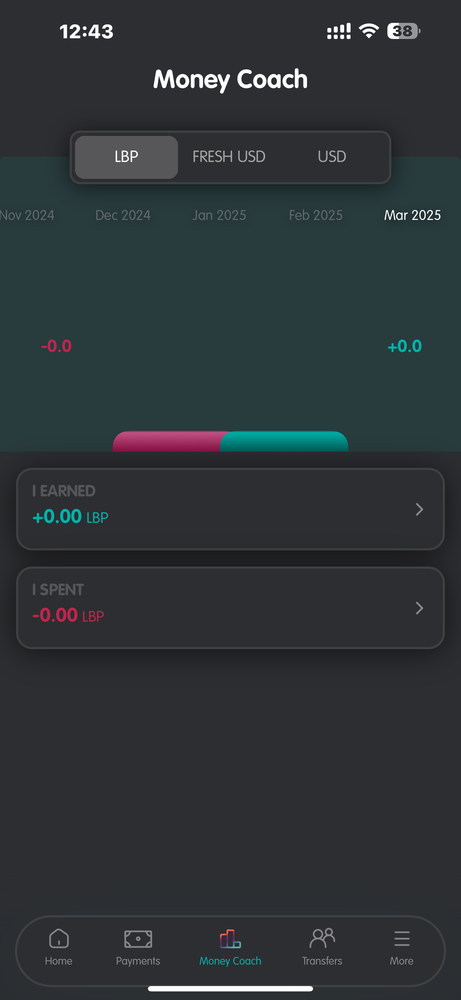

</td>
</tr>
</table>

---

<h3> Pic Answer - AI Image Analysis</h3>

<table width="100%">
<tr>
<td>

#### Overview
Developed a Flutter application that uses AI to analyze images and provide contextual information and answers based on visual content.

#### Technical Highlights
- Integrated cutting-edge image recognition API for accurate visual analysis
- Implemented camera functionality with real-time processing capabilities
- Created intuitive UI/UX for seamless image capture and analysis workflow
- Developed cross-platform compatibility with optimized performance on both iOS and Android
- Implemented offline capabilities for basic functionality without internet connection

</td>
</tr>
<tr>
<td>

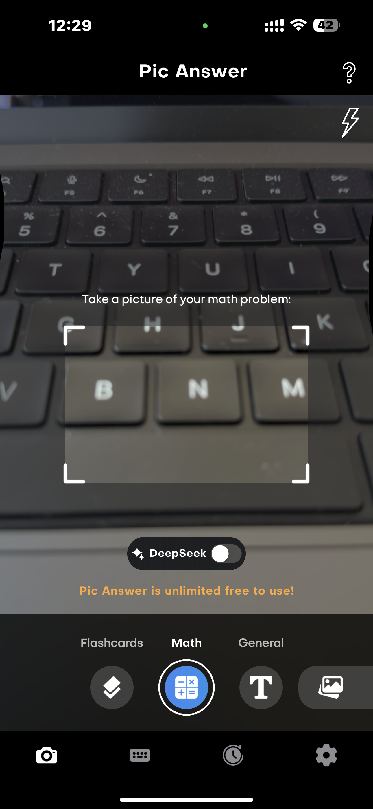
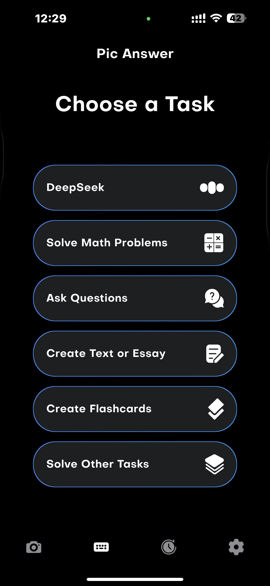
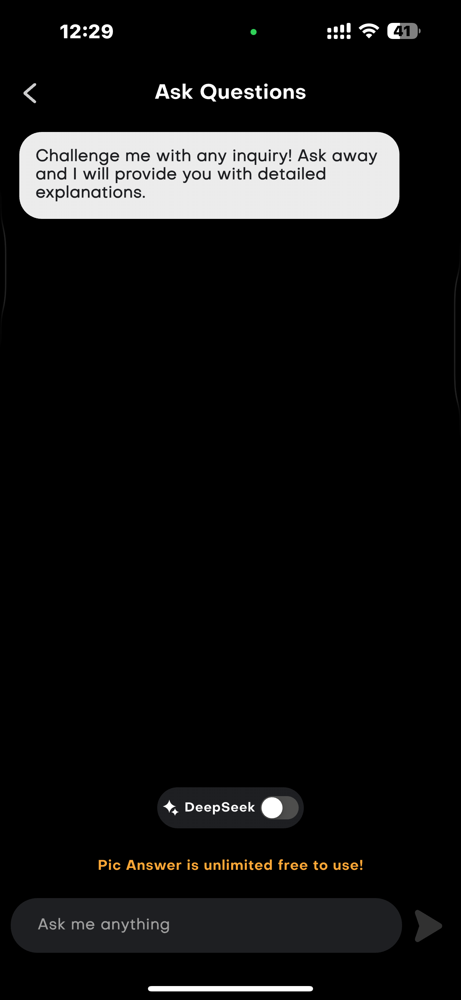

</td>
</tr>
</table>

---

<h3> Malak Al Taouk - Restaurant App</h3>

<table width="100%">
<tr>
<td>

#### Overview
Designed and developed a comprehensive restaurant application for Malak Al Taouk, featuring online ordering, menu browsing, and loyalty program functionality.

#### Technical Highlights
- Built with Flutter for cross-platform compatibility and consistent user experience
- Implemented secure payment processing with multiple payment options
- Created real-time order tracking system with estimated delivery times
- Integrated location services for delivery zone management and store locator
- Developed loyalty program with points system and rewards redemption

</td>
</tr>
<tr>
<td>

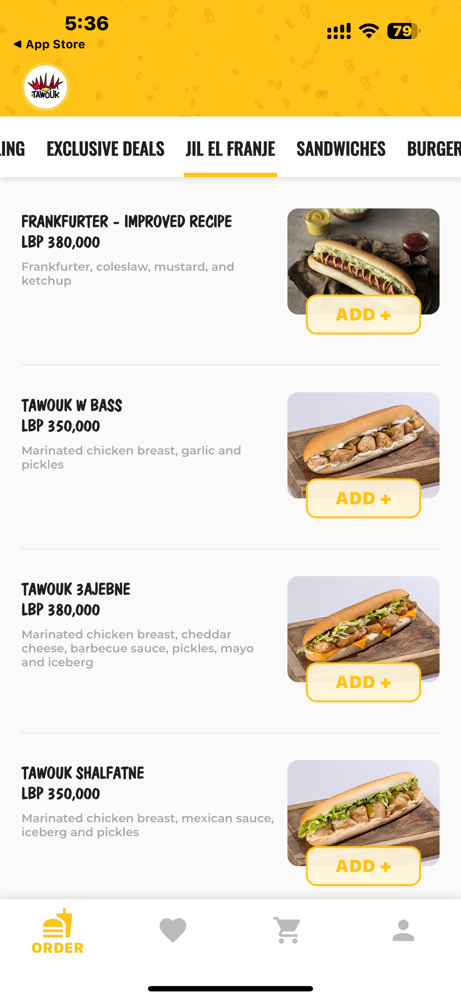
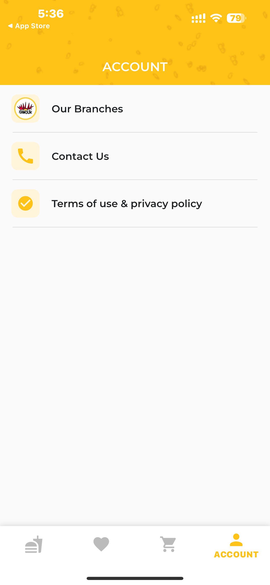
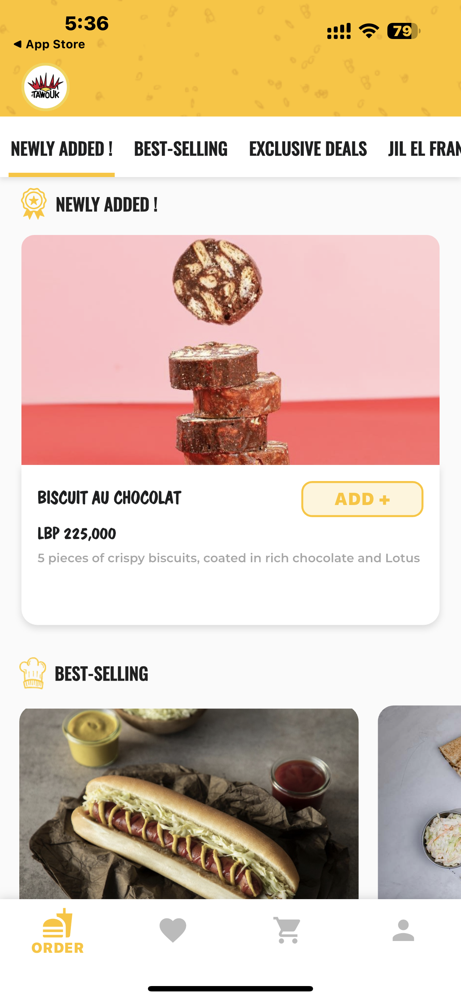

</td>
</tr>
</table>

---

<h3>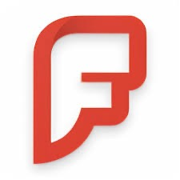 Fibler - Communication Platform</h3>

<table width="100%">
<tr>
<td>

#### Overview
Increased user satisfaction by 20% through redesigning the iOS app's user interface and enhancing communication features.

#### Technical Highlights
- Integrated real-time features including calls, video, and chat
- Enabled advanced functionality with AI and live-streaming
- Optimized app navigation using MVC and coordinator patterns
- Implemented RESTful services and crash reporting
- Increased data exchange capacity through advanced socket connections

</td>
</tr>
<tr>
<td>

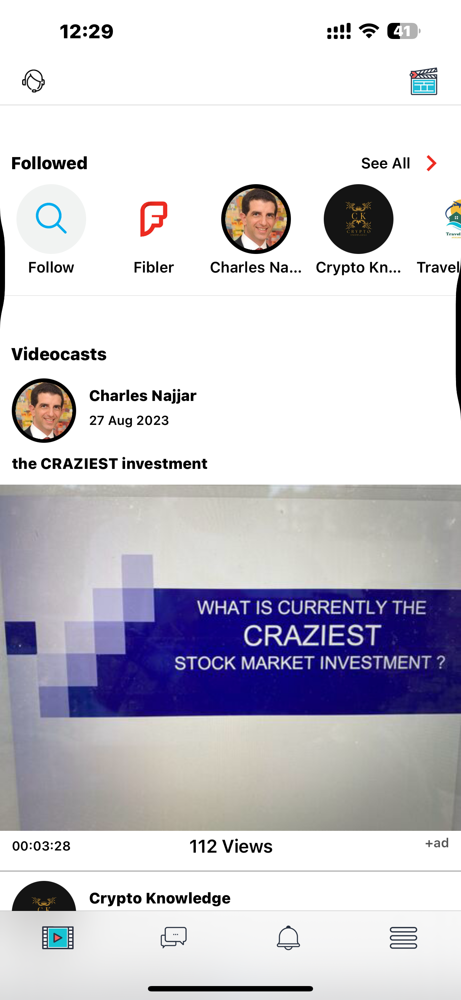
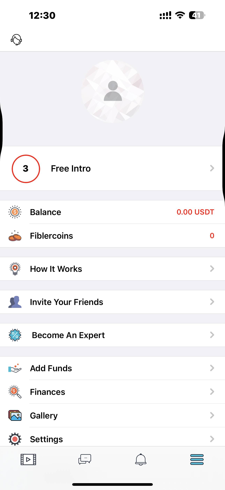
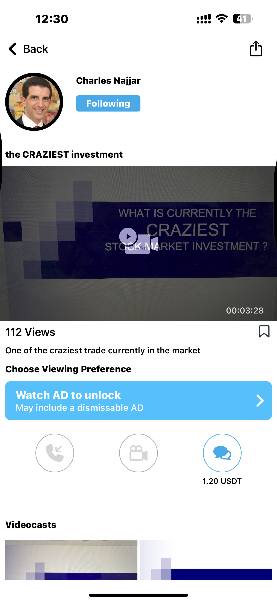

</td>
</tr>
</table>

---

<table width="100%">
<tr>
<td width="100%">

## Skills & Technologies

### Programming & Development
- **iOS**: Swift, SwiftUI, Objective-C
- **Flutter**: Dart, GetX, Bloc
- **Architecture & Design Patterns**: MVVM, MVC, Coordinator
- **Multithreading, Caching & Memory Management**
- **Networking**: RESTful APIs, GraphQL, WebSockets
- **Database Management**: Core Data, Realm, Firebase

### Tools & Technologies
- **Reactive Programming**: RxSwift, Combine
- **Dependency Injection & Modularization**
- **Testing & Optimization**: Unit/UI Testing, Performance Tuning
- **CI/CD Pipelines**: Fastlane, GitHub Actions, Xcode Cloud
- **Automation & Deployment**: TestFlight, App Store Connect, Firebase App Distribution

### Project Management & Methodologies
- **Agile Development**: Scrum
- **Version Control & Collaboration**: Git, Jira, Trello
- **User Analytics & Performance Monitoring**: A/B Testing, Crash Reporting
- **AI Augmented Defect Resolution**

</td>
</tr>
</table>

---

<table width="100%">
<tr>
<td width="100%">

## Education & Certifications

### Education
- **MS Computer and Communication Engineering**  
  American University of Science and Technology (AUST)  
  Beirut, Lebanon - 06/2018 - 02/2020

- **BS Computer and Communication Engineering**  
  American University of Science and Technology (AUST)  
  Beirut, Lebanon - 11/2012 - 06/2017

### Certifications
- **Completed**
  - Clean code
  - MVVM Swift
  - BDD Swift
  - Swift Concurrency
  - Flutter Development Bootcamp

- **In Progress**
  - Advanced CoreData
  - Unit Testing Swift
  - SwiftUI and SwiftData

### Languages
- **Arabic**: Native
- **English**: Proficient

</td>
</tr>
</table>

---

<table width="100%">
<tr>
<td width="100%">

## Experience Timeline

- **Senior iOS & Flutter Developer** - Supono Holdings (01/2022 - Present)
- **Senior iOS Developer** - Simly (01/2024 - 01/2025)
- **Senior iOS Developer** - Saradar Bank (06/2021 - 12/2022)
- **iOS Developer** - Fibler (01/2019 - 05/2021)
- **Junior iOS Developer** - Chip (10/2017 - 12/2018)

</td>
</tr>
</table>

---

© 2025 Johnny Owayed - Senior iOS & Flutter Developer

